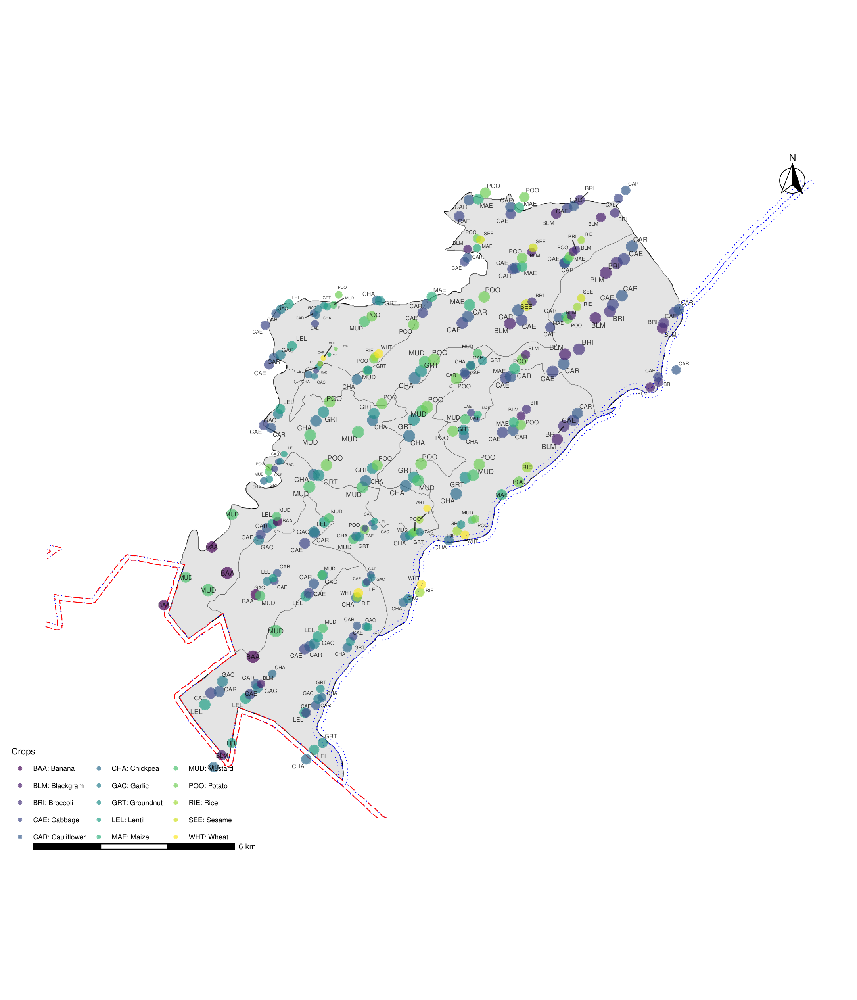

```{r setup, include=FALSE}
library(tidyverse)
require(DiagrammeR)
require(viridis)

theme_set(theme_light())
knitr::opts_chunk$set(tidy = FALSE, cache = TRUE, 
                      echo = FALSE, 
                      tidy.opts = list(width.cutoff=50), 
                      eval = TRUE, warning = FALSE, message = FALSE,
                      # fig.show = "hold", 
                      fig.align = "center", fig.width = 5,
                      fig.asp = 0.9, out.width = "0.6\\linewidth")
options(knitr.kable.NA = "", digits = 3)

def.source.hook  <- knitr::knit_hooks$get("source")
knitr::knit_hooks$set(source = function(x, options) {
  x <- def.source.hook(x, options)
  x <- ifelse(!is.null(options$linestretch), 
              paste0("\\linespread{", options$linestretch,"}\n", x, "\n\n\\linespread{", lstr,"}"), 
              x)
  ifelse(!is.null(options$size), 
         paste0("\\", options$size,"\n\n", x, "\n\n \\normalsize"), 
         x)
})
```

<!-- \linenumbers -->

\newpage

I'm in the process of drafting a review article entitled "Digital tools and techniques in agriculture: New and extensibility prospects for Nepal".

I have generated a framework and some broad ideas about what the article should exposit. I also have added some in-text citations for reference documents. Current draft is, however, very crude in that some of the sentences are totally off place and irrelevant, while linking structures and ideas are missing elsewhere.

Based off of following draft complete the essay, laying special focus on the paragraph bits and sentences where parenthetical prompts are included. Make suggest new ideas and scientific studies for reference. Structure the writing formally and make smooth transitions between ideas that each paragraphs are intended to convey.


## What digital tools and techniques mean


(... add encyclopediac definitions each of tool and technique, and reference to document suggesting that idea.)

## How do technique (technology use) differ from technology


Technique is related more with use and extension of knowlege, rather than it's generation (confirm correctness!). (... add a pet example of what distinguishes technique from technology.)

(Offer more insights to following ideas and generate individual paragraphs for each ...)

- Technology may become obsolete but technique can always be extrapolated and augmented.
- A technology, including a wide set of infrastructure needs, generation is costly. But techniques more the pieces that are cheap accumulate. Learning technique basically needs scaled down verion or some simplified model of the actual technology only, which is quite cheap to do.

## Current policies and statutes in use of digital tools and information technology in Nepal

The National Communication Policy, 1992 (B.S. 2049), the Telecommunication Act, 1996
(B.S. 2053), and the Telecommunication Regulation, 1997 (B.S. 2054) opened the telecom sector to liberalization and competition.

- The IT Policy of 2000 (B.S. 2057) aimed to use IT as a tool to achieve national development goals.
- The IT Policy of 2010 (B.S. 2067) emphasized using IT for socio-economic devel opment and poverty reduction, highlighting the importance of securing data and ensuring information confidentiality.

Constitution of Nepal, 2072 has included the use and development of IT as a key component of national development, ensuring public access and participation.

The Electronic Transaction Act, 2006 (B.S. 2063) and its Regulation, 2007 (B.S. 2064) were enforced to ensure secure and reliable electronic transactions and prevent unauthorized access to electronic records.

The Information and Communication Technology Policy, 2015 promotes good governance and addresses:

- Establishing cybersecurity institutions,
- Effective identification, prevention, and defense against cyber-attacks,
- Capacity-building programs for cybersecurity,
- Formation of Computer Emergency Response Team (CERT) for timely response to cybersecurity challenges.

The National Security Policy, 2018 (B.S. 2075) has included cybersecurity as a critical dimension of national security. Likewise, to identify cybersecurity risks, reduce their impact, and manage incidents, the Information Technology Emergency Support and Management Directive, 2018 (B.S. 2075) was issued. The Cyber Security Bylaw, 2020 (B.S. 2077) was introduced to regulate IT systems of telecom and internet service providers. Additionally, current periodic plan^[https://npc.gov.np/content/6462/the-sixteenth-plan--fical-year-2024-25-2028-29-/] (The Sixteenth Plan) prioritizes the creation of a Cyber Security Monitoring Center to enhance cybersecurity and privacy protection.

In similar spirits, broader framweorks like Digital Nepal Framework, 2019 (B.S. 2076) envisions the establishment of a National Cyber Security Center and other cybersecurity-related initiatives. Likewise, other operational frameworks include IT System Management and Operation Directive, 2014 (B.S. 2071) and Online Child Safety Directive, 2019 (B.S. 2076).

The Government of Nepal has prioritized cybersecurity in its annual plans and programs. The need for a digital safeguarding of public sector testaments and records and tight integration of administrative services to digital ecosystem is being recognized as much imminent post-GenZ revolution of Bhadra 23-24 in Nepal. (Add more context and few sentence of justification ...)

## Relevance of digital tools and technology use in context of Nepalese agriculture

Current global agricultural trends, not withstanding even a few decade-only old, are drastically different and rely on a completely new set of tools and technologies. Tilling (primary and secondary, both) implements mostly include tractor and power/mini tiller mounted cultivators, planters, ridgers, pulvarizers, puddlers, weeders, etc. An edge in gaining productivity with use of mini-tillers, even under hill agro-ecology has already been demonstrated by @paudel2019scale. These tools are more powerful than ever before, and can be effortlessly augmente with basic information tool such as GPS or laser leveller. Such integration forms the foundation for precision farming and farm monitoring. Although some of these tools have found a way into practice, mostly under intensive crop cultivation, among large and small scale growers in select few regions [@paudel2023contributions], widespread use remains yet to be seen. One of the hurdles in scaling out the technologies being the presence of disaggregated units of farmlands, within a small agroecology, each behaving as individual management units.

- Continuous crop monitoring and forcasting are possible avenues of digital tools application. They can supplant or avert much of the hassles associated with production planning, product storage, harvest and their insurance, among others. (... suggest in what way an enterprise may use crop production records and market information while making a choice for agricultural insurance policies.)

- Digital infrastructures are cheap

- Foster wider cooperation and collaboration among farming systems component actors, and address inter-operability and inter-connectivity needs of administrative and policy bodies. (... add more detail)

- Digital service delivery and integration with validation process enables error proofing. Also, since employees and service recipients are required to make minimal contacts, it preserves equality and unbiasedness of the service delivery process. (... add more detail, logic and smoothen transition.)

- Low latency in service delivery mechanism (... add more ideas, include a simple but practical example.)


## Improving Information Reliability and Accuracy

In information paradigm, triangulation, introspection and recall techniques are the most convenient, cost-effective and are somewhat reliable for data accrual. Moreover, for making numerical estimates about complex processes and statuses, such as crop yield in agriculture, researchers often seek support from farmers and local experts in lieu of abovementioned techniques and infer yield levels. This, however, is subject to gaps in individuals' knowledge, their personal biases, inaccurate recollection and attitudinal variations.

Luckily, researchers need not rely merely on tale-tale information relay, these days.

A pre-requisite for such system to function efficiently and reliably is the development and deployment of data accrual, transformation, analysis and reporting pipelines -- all of which constitute the domain of digital information processing.

Although direct assessment of yield is always possible, which is often cost-prohibitive, investigators can now refer to more revealing components that are scientifically shown be correlated with the yield. An example approach is using the drone based imaging that collects information on field attributes such as crop density, height, weed density, etc. in terms of spectral emissions, which ultimately can be used to calculate net productivity of the region of interest. This can be used, after validation through on-field crop cut survey, for comparison across wide area.

Estimation of crop yield constitutes a major function of national agricultural governing body. Estimation combined with aggregation and reporting of nation/sub-national/local level production and yield data serves as a quantitative evidence to inform decision-making for agricultural policy and programs at the spatial scale of relevance.  Crop-cutting surveys have, since the very inception of knowledge based decision making process, been provisioning the required crop yield and productivity statistics. Two of the most commonly employed methods are crop cutting experiment and farmer recall or agricultural survey. Several literature document the rationale, sampling theory, criteria and implementation procedure for crop cut surveys [@nath2007manual]. Such use can be accomplished with an inexpensive, off-the-shelf, consumer-grade drone with a standard RGB (red, green, and blue) camera. A standard RGB camera may also be called a natural-color or true-color camera and will produce images similar to a digital point-and-shoot camera or smartphone camera.

Incidentally, both of our adjoining neighbor countries have presented themselves in the forefront of commercial drone manufacturing and marketing [@djiweb2023] and applications exploration. With recent surges in drone start-ups in India, the country is expected to dominate agriculture drone market with cheap and affordable hardware [@pathak2020use; @droneapplication2018], few years from now.

Agriculture is expected to be one of the largest markets for drones with global market size of drones projected to reach \$5.9 billion by 2030, with the expected economic value to reach \$500 [Grand View Research, Commercial drone market size, share; trends analysis report by product (fixed-wing, rotary blade, hybrid), by application, by end-use, by region, and segment forecasts, 2021–2028 (2021). www.grandviewresearch.com/industry-analysis/global-commercial-drones-market].

Drone-based harvest data prediction for commercial production [@wang2023drone] and assessment of crop and disease attributes during in field experiments [@bai2023rice; @guo2021uas], are both benefiting with the use of this high throughput and digitally enabled technology. The other end of the spectrum for current drone applications in agriculture is collection of georeferenced, multispectral images. Such systems involve sensors beyond standard RGB cameras, along with image processing, to generate maps of crop condition, or stress. Often such imagery is collected at regular intervals during the growing season to detect and help manage the onset of stress. Georeferenced images can be used in geographic information system (GIS) software to relate multispectral imagery to other geospatial information, such as yield maps. Such systems are more costly to purchase and operate, and processing and analysis of such imagery requires skill and time. In many cases, growers may choose to contract for collection and processing of such data with a crop consultant or image service.


Very few well designed observational studies have been carried out that have estimated yields in large scale commercial plantations and under a heteregeneous cultivation management system. However, the need to assess the yield and to quantify its variation of a crop grown under a large macro-ecological zone with small yet unsystematic field variations is dire. (Broaden this idea with reference to Nepal's condition)

Currently, the duty of planning for and executing of estimation and publication of agriculture production and productivity statistics is delegated to district level agriculture offices (AKCs), the latter is accountable to the provincial government.

While local governments are required to sketch out policy and regulatory devices, they too are responsible for implementation of various plans and programmes for betterment of agriculture and livestock rearing. Such governments are required to interfere in managing the agricultural produce in the area of their jurisdiction. Local government perform a multitude of functions of planning, implementing and maintaining a state of balance in food and production systems, aside from several other sectors. Delivering efficient governance requires a responsive information retrieval and summarization process as an aide to decision making. In a governance process with information based decision making, administrator/managers have a quick access to the reliable data generating system.

One or more forms of e-governance are already in practice in Nepal. Delivery of services though government to citizen (G2C), and navigating through institutional barriers and untangling personnels and resource are conveniently managed through digital tools and infrastructures in government to government (G2G) and government to employees (G2E) frameworks. Conceptually, tools in such frameworks are more or less mature and stable. They embody minimalist architecture, in that they accomplish only basic database management at the discretion of the operator's and offer user-friendly interface, and they do not interact directly with data accrual from complex physical environment, such as agricultural farms. (Suggest and add reference to a relevant textbook or well cited research paper).


There have been serious questions about truthfulness and reliability of agricultural data reported by government in the past. For example, a national media outlet underlined the discripancy in per capita consumption statistic of milk, meat and egg in 2017 report produced by two Nepal Rastra Bank and Ministry of Livestock Development [@DataDiscrepancyCreates2017]. 

Failing to keep abreast with digital technology adoption have beleaguered our farm enterprise management and up-scaling endeavors. While it takes several hours to traverse through a field of rice detect if crop patches show signs of blighting due to fungal/bacterial pathogen outbreak, with drone imagery, we can conveniently detect the signs of distress deep within boundries of crop field in a matter of minutes. At certain times, such patches where infestation by foliar pathogen, or segments with greater activity of insect vector where from the spread of infection is likely goes unnoticed during manual surveillance. An well-encompassing viewing angle and continuous glide over crop fields can help predict pathogenic outbreak early-on.

## Extending upon existing digital frameworks

### Conventional crop cut surveys design and implementation

Crop yield and acreage assessment constitute the basic information, for agricultural planning in scientific and information based governance. 

- Information about crop area and production is crucial for planning of economic development initiatives, allocation of resources and monitoring the achievements
- Area and production statistics has great importance for planners
  - preparation of national accounts of food crops
  - decision making on export/import and price
  - day to day management of the crop sector
- Statistical Information on Nepalese Agriculture (the annual agri-statistics publication) hosts acerage, crop production and basic farming household statistics.
- The data collection is entrusted to extension staff, who carry out crop cut surveys to assess crop yield.
- Crop cutting surveys are field surveys in which production data are collected through direct measurement for estimating yield of major field crops, paddy and wheat.
- The technique was developed during 1940s and 1950s.
- A plot} is randomly selected of a given size in the field of a specific crop and its produce is harvested following specified methodology.
- The harvested yield rate is calculated as the weight of the harvested crop divided by the area of the plot.

$$
\text{Estimated crop yield} = \frac{\text{Weight of harvest crop}}{\text{Area of the selected plot}}
$$

**Steps in Crop-cutting**

- Selecting a field of mature crop ready for harvest
- Identifying the south-west corner of field from where crop cut has to be done
- Randomly demarcating the crop-cutting plot of a specified size (generally 10 or 20 msq)
- Meticulously determining the plants to be included in the crop-cut plot
- Harvesting of crop cut plot
- Threshing and winnowing to get cleaned harvest
- Weighing and adjusting the harvet to a specified level of moisture content
- Converting the harvest to a standard unit, for example tons per hectare.

**Crop cutting survey design and selection**

- The design adopted in the survey is stratified multi-stage random sampling
  - Districts are taken as strata
  - Specific local units (municipalities) are the first stage units
  - Fields growing the crop under crop cutting experiments are the second stage units
  - Experimental plots of specified size are the ultimate stage units
- In the strata, list of all villages with area growing the experimental crop is obtained
- Generally in a district with 30 local units, 8-10 municipals are selected by SRS.
- In field selection, agriculture technician proceeds to the selected village.
  - Cultivators are listed and serial number assigned to their fields
  - Fields are selected by Simple Random Sampling.

**Harvesting and yield estimation**

- Harvested when crop is fully mature
- Date is fixed by the field assistant in consultation with the cultivators concerned
- Produce from the plot is harvested before the harvest of the entire field
- Threshing, winnowing, weighing of the harvested produce and recording of green/fresh produce
- Driage experiments are performed to get marketable form of produce from cultivating fields.
  - dry a fixed quantity of harvested produce (generally 1 kg) in the experimental plot by keeping the produce for a few days for drying and weighing the produce everyday till the weighings on two successive days reveal "negligible"  reduction in weight
- Weight of marketable produce of crop may be obtained by applying the moisture level recorded with the moisture meter to the normal level of moisture of the produce.
- In countries with regular agricultural reporting system, crop area ($A$) is obtained from records on complete enumeration basis.
- Average crop yield ($Y$) is estimated by CCE on a sample basis.

$$
\text{Crop production} (P) = A \times Y
$$

- In countries where cadastral maps are available not no regular reporting system, both A and Y are estimated on the basis of sample surveys.
- Usually large sample of villages (primary units) is selected for crop area estimation. This provides estimate of A
- CCE are carried out in a sub-sample of the primary units selected for area enumeration. This provides estimate of $Y$.

- Estimating yield from a district survey:
  - Number of stratum (s): $S$
  - Area under the crop in the $s^{th}$ stratum: $a_s$
  - Number of villages (i): $n_s$
  - Number of field (j) in the $i^{th}$ village: $n_{si}$
  - Experimental plot selected

If $y_{sij}$ be the observed yield from the selected plot of the $j^{th}$ field of the $i^{th}$ village of the $s^{th}$ stratum, then

Estimated average of green yield for the $s^{th}$ stratum is:

$$
\small
\hat{\bar{Y}}_s^g = \frac{1}{n_s} \sum^{n_{s}}_{i = 1} \frac{1}{n_{si}} \sum^{n_{si}}_{j = 1} y_{sij}
$$

Estimate of the district level average yield of the dry marketable produce per hectare is given by:

$$
\small
\hat{\bar{Y}}^m = d \times f \times \frac{\sum^S_{s = 1} a_s \hat{\bar{Y}}_s^g}{\sum^S_{s = 1}a_s}
$$

Where:

- d: driage ratio, 
- f: conversion factor for green yield to dry marketable produce per hectare i.e. rice = 2/3 of paddy.

(... structure the section and reduce significantly while only retaining most informative bits. Refine the sampling framework to reflect Nepal's administrative division into Federal, Province, District, Municipalities and Wards strata. Ensure logical transition between ideas.)

### Imaging system to supplement crop cut surveys

Typically, precision agriculture applications such as yield estimation require a spatial resolution of 1-3 m [@sozzi2018benchmark]. Also, as the extent of area for which inference is to be made expands, the task becomes untenable as measures of field variability need to be tracked on both longi- as well as latitudinal coordinates. Fortunately, one of the most dauting of the tasks that enable precision farming -- data collection at regular spatial and temporal intervals of one or several aspects of field variability, simultaneously, can be digitized with the use of Unmanned Aerial Vechicle (UAV) or drone imagery.

Spatial and temporal aspects of field variability are rarely taken into account concurrently during study design and experimentation. This leads to the results of study either being disharmonious, owing to a narrow framework of geographical inference on which experiment was carried out, or being irrelevent entirely due to the changing field variability. Those aspects of variability generally include, but not confine to, variability in soil resource base, weather, plant genetics/variety, crop diversity, machinery performance, states of input management practiced by the producer. This inadvertently results in yield differences across land units. . It is virtually useless to develop near real-time decision support systems for farming required based on conventional sampling procedure. (... simplify the ideas, avoiding irrelevant bits from above two paragraphs and present them logically.)

Drones are now being commonly used in agricultural system for data generation. Use of aerial aids to survey and monitor agricultural fields is thought to lead to a quicker data gathering and accurate assessment of production and yields. Likewise, in conjunction with widespread connectivity and fast data processing and analysis pipelines, near real-time management of fields while identifying problematic pockets is possible [@tripicchio2015towards].

(... add how crop cut surveys can be supplemented with indirect appraisal of productivity via aerial imagery. Briefly include concept of NDVI as indicator of yield, suggest reference for citation.)

## Normalized difference vegetation index

- NDVI is a simple graphical indicator that can be used to analyze remote sensing measurements, assessing whether or not the target being observed contains live green vegetation -- hence provides measurement of crop health.
- Current research has proved that the NDVI images can even be obtained using the normal digital RGB cameras by some modifications in order to obtain the results similar to those obtained from the multispectral cameras
- First normalized difference spectral index was formulated by Kriegler et al. in 1969.
- Rouse et al. first applied the NDVI in the great plains in 1973.

- Green plants absorb solar radiation in the PAR spectral region and wavelengths longer than about 700 nm are too large to be used, hence reflected back.
- Live green plants appear relatively dark in the PAR and relatively bright in the near-infrared
- By contrast, clouds and snow tend to be rather bright in red (and visible wavelengths) and quite dark in the NIR.
- Early instruments of Earth Observation, such as NASA's ERTS and NOAA'a AVHRR, acquired data in visible and near-infrared spectrum. Strong differences in plant reflectance was then used to determine their spatial distribution.

NDVI is calculated from these individual measurements as follows:

$$
NDVI = \frac{NIR - Red}{NIR + Red}
$$

where Red and NIR stand for the spectral reflectance measurements acquired in the red (visible) and near-infrared regions, respectively. These spectral reflectances are themselves ratios of the reflected radiation to the incoming radiation in each spectral band individually, hence they take on values between 0 and 1. By design, the NDVI itself thus varies between -1 and +1.

Aerial imagery imagery be analysed using algorithmic routines of variying complexities -- binary classification to neural networks for applications like nutrient status and crop health monitoring and yield estimation for individual farms.

Currently it is common to use base fertilizer, or top dressing through experience. It will result in too much or not enough N, which not only inhibits crop growth but also pollutes the environment. How to monitor rice and wheat canopy N timely and accurately, so as to guide variable rate fertilization has become a core research issue [@moharana2016spatial, @thorp2017hyperspectral]. Moreover, importance of taking into account the crop phenology while making tailored recommendation for Nitrogen and water management has already been demonstrated by @zhu2022uav in Maize.

Timely irrigation of cropping fields is essential to realize a sizeable quantity of harvest, so much so that design based experimental runs conducted in dryland environment of China from 2009 through 2013 highlight a quadratic relationship between winter wheat yield and rain supply of water at two critical growth periods [@cao2017tailoring]. Drones having multispectral and thermal sensors can detect the pockets in field that have depleted soil moisture. Once the location of pockets are pin pointed, or are the moisture profile contours of the field obtained, sprinkler irrigation may be issued in such a way that only the region of stress receives adequate amount of water. (... merge ideas of preceding paragraph, simplify it and offer context for application in Nepal's smallholder-majority system.)

- Vegetation extraction from remote sensing imagery is the process of extracting vegetation information by interpreting satellite images based on the interpretation elements such as the image color, texture, tone, pattern and association information, etc.
- Diverse methods (broadly grouped) either as supervised or as unsupervised depending on whether or not true ground data are inputted as references.
- General steps involved in vegetation mapping include
  - image preprocessing (improve the quality of original images, highlighting the distinguishing features)
  - image classification (results in the assignment of each pixel of the scene to one of the vegetation groups defined in a vegetation classification system or a membership matrix of the vegetation groups if fuzzy classification is adopted)

### Crop suitability mapping using public domain data

In order to prevent exploitation of land or to use it to its potential, the rational basis of land-use
planning is to determine what resources (or in agricultural terms intrinsic factors) the land can offer. FAO, 1993 details a comprehensive framework for suitability classification of land, based on several land "qualities". Broad qualities include availability of energy, availability of water, conditions for ripening, climatic hazards, sufficiency of oxygen in the root zone, sufficiency of nutrients, erosion hazard and toxicity (United Nations. Soil Resources, Service, and United Nations. Interdepartmental Working Group on Land Use Planning 1993). While the information on several qualities is justified for broad scale land-use planning, planning for a small unit (for example local administrative region), where various characteristics of climatic/erosion hazards and energy and water availability are similar should offer leniency as to their inclusion. However, depending upon the scale of interpretation, factors such as soil, topography, vegetation patterns, precipitation, temperature, soil parent material, land cover type, landform classes constitute important covariates for inferring about crop suitability to agricultural land.

The wealth of geographical and remotely sensed data publicly available, nowadays, can serve as a starting point in making informed decisions about scientific land management [@huang2018agricultural]. With the focus of all three tiers of government on scientific land mapping for various purposes, identification of crop pockets will assist in agriculture production planning and mechanization. Farmholds and local planners benefit by having a concrete visual map of what focus is to be laid where. Moreover, this data driven information support system can help identify most profitable ventures, while tapping geographical comparative advantage.

@dhakal2024gridded used publicly available (from NARC Nepal as raster layers) soil from from 23,273 soils samples, collected from 56 districts covering seven provinces which were combined with a stack of 168 remote sensing-based soil covariates (SRTM DEM derivatives, climatic images, vegetation index etc.). Later the spatial predictions on 250x250m grids were generated using a machine learning method and the random forest. Thematic soil data on percentage Nitrogen content (PNC) and absolute pH value (pH) and elevation (EL) data layers were acquired for processing, supplemented with satellite based land use data (obtained from openly sourced OpenStreetMaps database) representing cultivated, residential and water bodies Figure \ref{fig:crop-map-tikapur} crop suitability map of multiple crops (as indicated in legend entries) in each of 58 grid pockets of Tikapur, Kailali, Nepal were created.

The approach is flexible with respect to the number of thematic variables that may be composited to obtain suitability ranking of individual crops, although its strictly required for them to be of same resolution; with respect to the number of crops for mapping as long as thresholding parameters are agreeably defined in literature. The method can also be scaled-up for any grid size for aggregation mapping as it relies on a simple rank based statistic. Information value of such maps can be extended by adding information on crop seasonality and agro-climatological variables.

```{r crop-map-tikapur, fig.cap="Crop suitability map showing depiction of crops with points scaled proportionate to their suitability rank.", out.width="80%"}

```


# Bibliography
